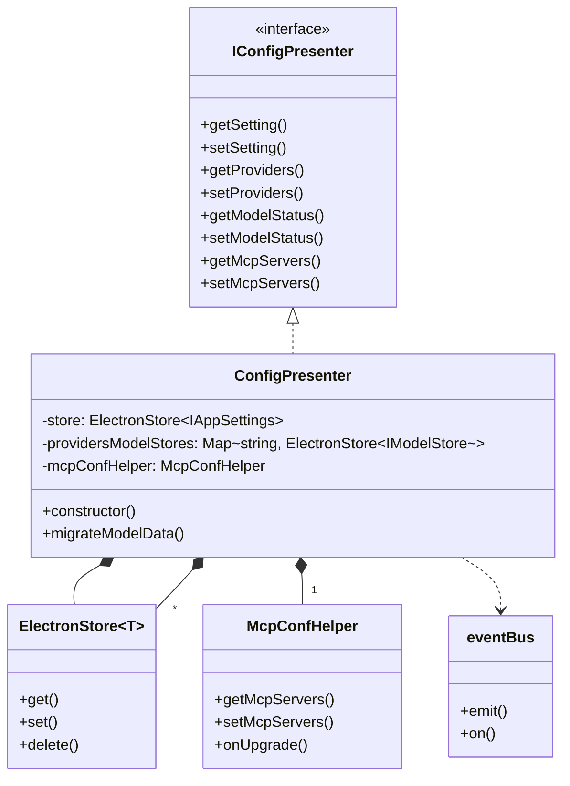
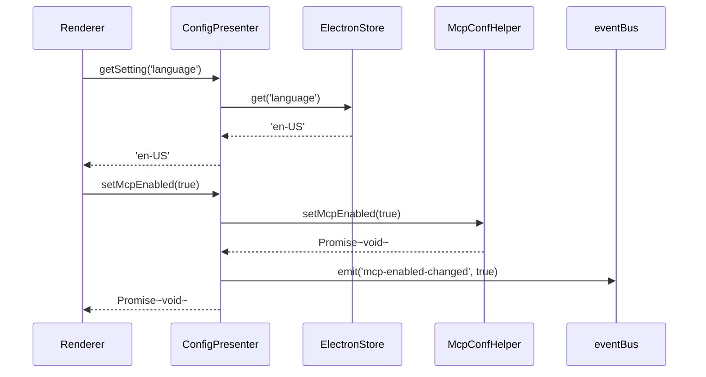
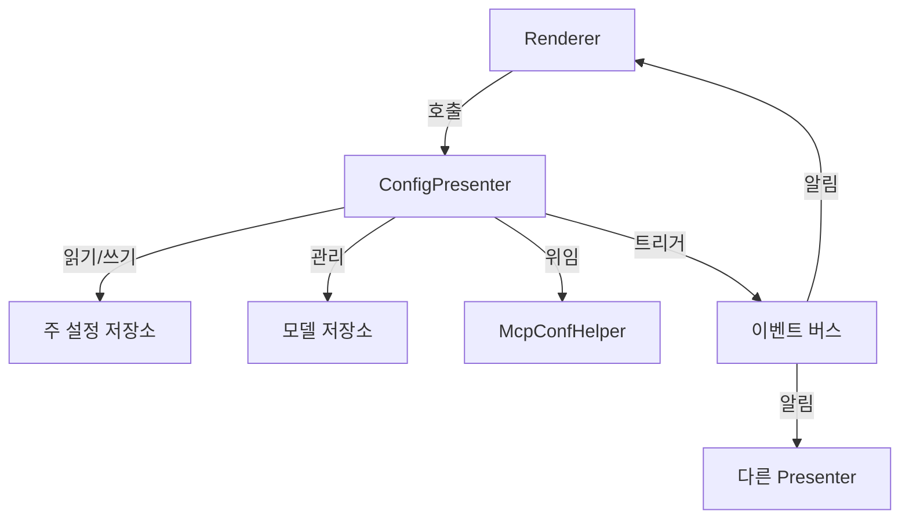

# ConfigPresenter 아키텍처 다이어그램

## 클래스 관계도



## 데이터 흐름도



## 저장 구조

### 주 설정 저장소 (app-settings.json)

```json
{
  "language": "en-US",
  "providers": [
    {
      "id": "openai",
      "name": "OpenAI",
      "apiKey": "sk-...",
      "enable": true
    }
  ],
  "model_status_openai_gpt-4": true,
  "proxyMode": "system",
  "syncEnabled": false
}
```

### 모델 저장소 (models_openai.json)

```json
{
  "models": [
    {
      "id": "gpt-4",
      "name": "GPT-4",
      "maxTokens": 8192,
      "vision": false,
      "functionCall": true
    }
  ],
  "custom_models": [
    {
      "id": "gpt-4-custom",
      "name": "GPT-4 Custom",
      "maxTokens": 8192
    }
  ]
}
```

## 컴포넌트 상호작용



## 핵심 설계 포인트

1. **인터페이스 분리**: IConfigPresenter 인터페이스를 통해 공통 API 정의
2. **단일 책임 원칙**: McpConfHelper는 MCP 관련 로직만 처리
3. **이벤트 기반 설계**: 이벤트 버스를 통해 설정 변경 사항을 알림
4. **버전 호환성 고려**: 내장 데이터 마이그레이션 메커니즘 포함
5. **타입 안전성 확보**: 제네릭 인터페이스 사용으로 타입 안정성 보장
