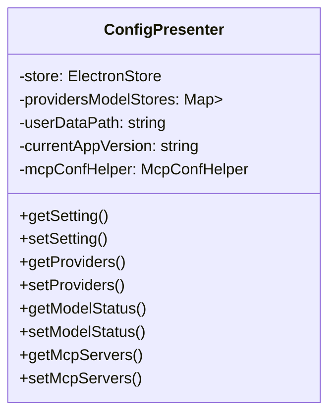
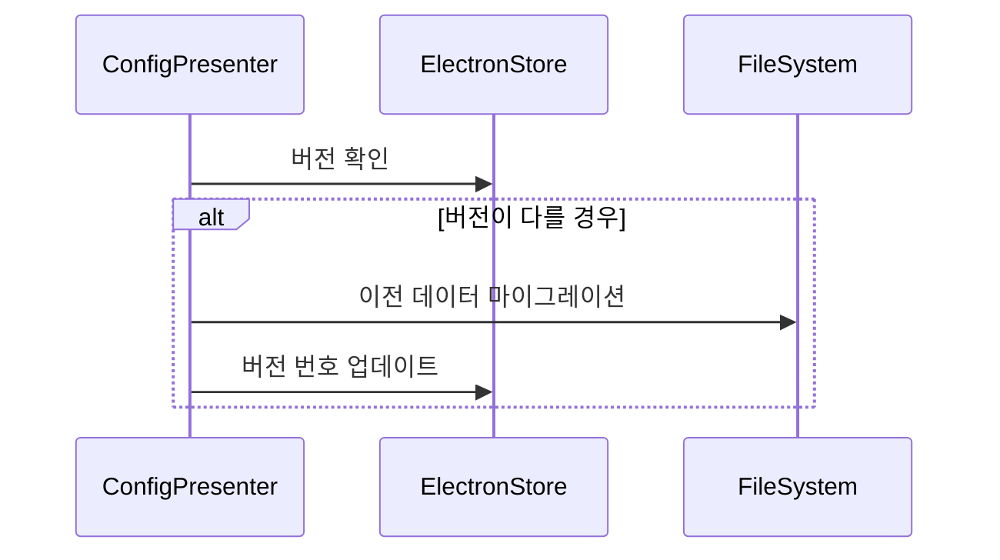

# ConfigPresenter 모듈 설계 문서

## 기능 개요

ConfigPresenter는 DeepChat의 핵심 설정 관리 모듈로, 애플리케이션의 다양한 설정 항목을 관리합니다. 주요 기능은 다음과 같습니다:

1. 애플리케이션 기본 설정 (언어, 프록시, 동기화 등)
2. LLM 제공자 설정
3. 모델 관리 (기본 모델 및 사용자 정의 모델)
4. MCP (Model Control Protocol) 서버 설정
5. 데이터 마이그레이션 및 버전 호환성 처리

## 핵심 설계

### 1. 저장소 아키텍처

ConfigPresenter는 계층형 저장소 설계를 채택하고 있습니다:

- **주 설정 저장소**: ElectronStore를 사용하여 애플리케이션 기본 설정 저장
- **모델 저장소**: 각 LLM 제공자는 독립적인 ElectronStore 인스턴스를 가짐
- **상태 저장소**: 모델 활성화 상태는 주 설정에 별도로 저장



### 2. 주요 인터페이스

#### 애플리케이션 설정 관리

- `getSetting<T>(key: string): T | undefined`
- `setSetting<T>(key: string, value: T): void`

#### 제공자 관리

- `getProviders(): LLM_PROVIDER[]`
- `setProviders(providers: LLM_PROVIDER[]): void`
- `getProviderById(id: string): LLM_PROVIDER | undefined`
- `setProviderById(id: string, provider: LLM_PROVIDER): void`

#### 모델 관리

- `getProviderModels(providerId: string): MODEL_META[]`
- `setProviderModels(providerId: string, models: MODEL_META[]): void`
- `getCustomModels(providerId: string): MODEL_META[]`
- `setCustomModels(providerId: string, models: MODEL_META[]): void`
- `addCustomModel(providerId: string, model: MODEL_META): void`
- `removeCustomModel(providerId: string, modelId: string): void`

#### MCP 설정 관리

- `getMcpServers(): Promise<Record<string, MCPServerConfig>>`
- `setMcpServers(servers: Record<string, MCPServerConfig>): Promise<void>`
- `getMcpEnabled(): Promise<boolean>`
- `setMcpEnabled(enabled: boolean): Promise<void>`

### 3. 이벤트 시스템

ConfigPresenter는 eventBus를 통해 다음과 같은 설정 변경 이벤트를 발생시킵니다:

| 이벤트 이름                            | 발생 시점                | 파라미터                          |
| ------------------------------------- | ----------------------- | --------------------------------- |
| CONFIG_EVENTS.SETTING_CHANGED         | 설정 항목 변경 시        | key, value                        |
| CONFIG_EVENTS.PROVIDER_CHANGED        | 제공자 목록 변경 시      | -                                 |
| CONFIG_EVENTS.MODEL_STATUS_CHANGED    | 모델 활성 상태 변경 시   | providerId, modelId, enabled      |
| CONFIG_EVENTS.MODEL_LIST_CHANGED      | 모델 목록 변경 시        | providerId                        |
| CONFIG_EVENTS.PROXY_MODE_CHANGED      | 프록시 모드 변경 시      | mode                              |
| CONFIG_EVENTS.CUSTOM_PROXY_URL_CHANGED| 사용자 프록시 URL 변경 시| url                               |
| CONFIG_EVENTS.ARTIFACTS_EFFECT_CHANGED| 애니메이션 효과 변경 시  | enabled                           |
| CONFIG_EVENTS.SYNC_SETTINGS_CHANGED   | 동기화 설정 변경 시      | { enabled, folderPath }           |
| CONFIG_EVENTS.CONTENT_PROTECTION_CHANGED | 화면 보호 설정 변경 시 | enabled                           |
| CONFIG_EVENTS.SEARCH_ENGINES_UPDATED  | 검색 엔진 설정 변경 시   | engines                           |

### 4. 데이터 마이그레이션 메커니즘

ConfigPresenter는 버전을 인식하는 데이터 마이그레이션을 구현합니다:



마이그레이션 로직은 다음을 포함합니다:

1. 모델 데이터를 주 설정에서 독립 저장소로 이동
2. 모델 상태를 모델 객체에서 분리하여 독립 저장소로 이동
3. 특정 제공자의 URL 포맷 수정

## 사용 예시

### 현재 언어 설정 가져오기

```typescript
const language = configPresenter.getLanguage()
```

### 사용자 정의 모델 추가

```typescript
configPresenter.addCustomModel('openai', {
  id: 'gpt-4-custom',
  name: 'GPT-4 Custom',
  maxTokens: 8192
  // ...기타 속성
})
```

### MCP 기능 활성화

```typescript
await configPresenter.setMcpEnabled(true)
```

## 모범 사례

1. **설정 접근**: 항상 getSetting/setSetting 메서드를 통해 설정을 접근하고 store를 직접 조작하지 말 것
2. **이벤트 리스닝**: 설정 변경에 관심 있는 부분은 관련 이벤트를 수신하고 주기적으로 확인하지 말 것
3. **모델 관리**: 사용자 정의 모델은 전용 메서드를 통해 관리하고 저장소를 직접 수정하지 말 것
4. **버전 호환성**: 새 설정 항목을 추가할 경우 기본값과 마이그레이션 로직을 고려할 것

## 확장성 설계

1. **IAppSettings 인터페이스**: 인덱스 시그니처를 사용하여 다양한 설정 키를 허용
2. **McpConfHelper**: MCP 관련 로직을 보조 클래스로 분리
3. **제공자 식별자**: providerId 문자열을 사용하여 동적 제공자 지원 (enum 대신)
