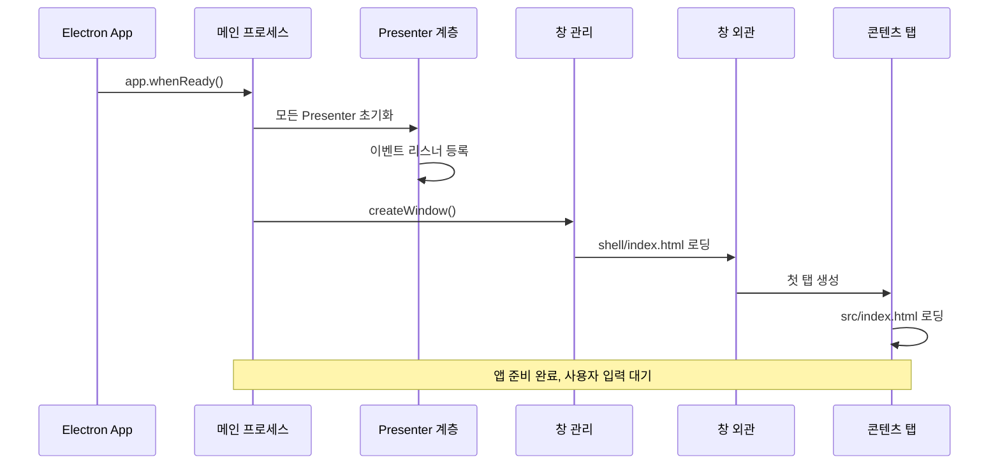
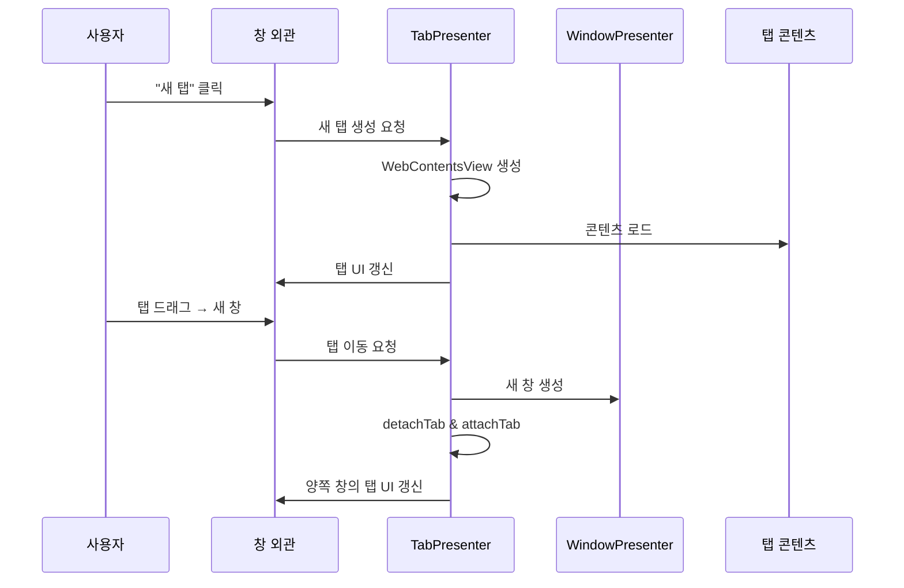
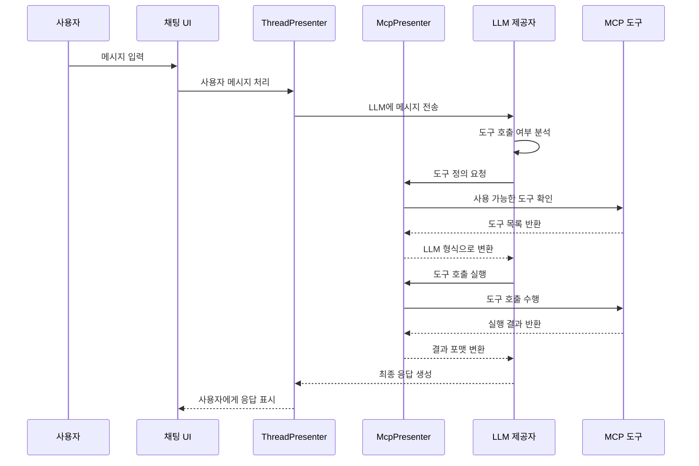

# DeepChat 아키텍처 개요

이 문서는 DeepChat 프로젝트의 전체적인 아키텍처를 설명하며, 개발자가 실행 흐름과 구조를 빠르게 이해하는 데 도움을 줍니다.

## 🏗️ 전체 아키텍처 다이어그램

(※ Mermaid 다이어그램은 그대로 유지되며 번역 대상이 아닙니다. UI 또는 MD View에서 렌더링 가능)

## 🔄 핵심 실행 흐름

### 1. 애플리케이션 시작 흐름



### 2. 다중 창/탭 관리



### 3. MCP 도구 호출 흐름



## 🏛️ 아키텍처 설계 원칙

### 1. 계층화 아키텍처

- **메인 프로세스 계층**: 시스템 작업, 창 관리, 핵심 로직
- **렌더러 계층**: 사용자 인터페이스 및 상태 관리
- **Preload 계층**: 보안 IPC 브리지 제공

### 2. Presenter 패턴

- 기능별로 Presenter 클래스를 분리
- Presenter는 상태 및 비즈니스 로직 담당
- EventBus로 컴포넌트 간 느슨한 연결 유지

### 3. 다중 창 & 탭 구조

- **Shell(창 외관)**: 탭 UI 관리
- **Content(탭 내용)**: 전체 앱 기능 포함
- **Vue 인스턴스 분리**: 관심사 분리 및 성능 향상

### 4. 이벤트 기반 구조

- 이벤트 명명 규칙 일관성 유지
- 이벤트 책임 명확 분리
- 순환 참조 및 충돌 방지

## 🔧 핵심 구성요소 설명

### WindowPresenter & TabPresenter

- `WindowPresenter`: BrowserWindow 인스턴스 관리
- `TabPresenter`: WebContentsView 생성/삭제/이동 관리
- 탭을 창 간에 드래그하여 이동 가능

### McpPresenter

- `ServerManager`: MCP 서버 연결 및 수명 관리
- `ToolManager`: 도구 캐시 및 권한 제어
- LLM <-> MCP 도구 형식 간 변환 기능 포함

### ThreadPresenter

- 대화 세션 생성, 전환, 기록 관리
- 메시지 흐름 조율, LLM 호출 포함
- 스트리밍 응답, 오류 복구 처리

### ConfigPresenter

- 사용자 설정, 모델 설정, MCP 설정 관리
- 설정 변경 시 이벤트 발송
- 설정 데이터의 저장 및 마이그레이션 지원

## 🚀 개발 시작 가이드

### 1. 개발 환경 준비

```bash
npm install     # 의존성 설치
npm run dev     # 개발 서버 실행
```

### 2. 주요 디렉토리 구조

- `src/main/presenter/` - 메인 비즈니스 로직
- `src/renderer/src/` - Vue UI 컴포넌트
- `src/renderer/shell/` - 탭 바 UI
- `src/shared/` - 타입 정의 및 공통 코드

### 3. 주요 작업 예시

- **기능 추가**: 새로운 Presenter + Vue 컴포넌트 작성
- **MCP 도구 확장**: McpPresenter에 도구 등록
- **UI 컴포넌트 개발**: Vue3 + Tailwind CSS 사용
- **데이터 저장**: SqlitePresenter 또는 ConfigPresenter 사용

### 4. 디버깅 팁

- 메인 프로세스: VSCode 브레이크포인트 + Electron DevTools
- 렌더러: Chrome DevTools
- MCP 도구: 내장 디버깅 창
- 이벤트 흐름: EventBus 로그 추적

## 📚 관련 문서

- [다중 창 아키텍처 문서](./multi-window-architecture.md)
- [MCP 아키텍처 문서](./mcp-presenter-architecture.md)
- [이벤트 시스템 문서](./event-system-design.md)
- [개발자 가이드](./developer-guide.md)

---

이 아키텍처 문서와 다이어그램은 DeepChat 프로젝트 구조에 대한 전체적인 시야를 제공합니다. 코드 위치 파악과 시스템 이해에 유용합니다.
