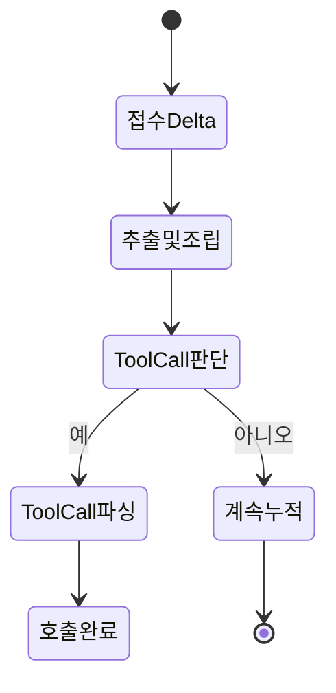
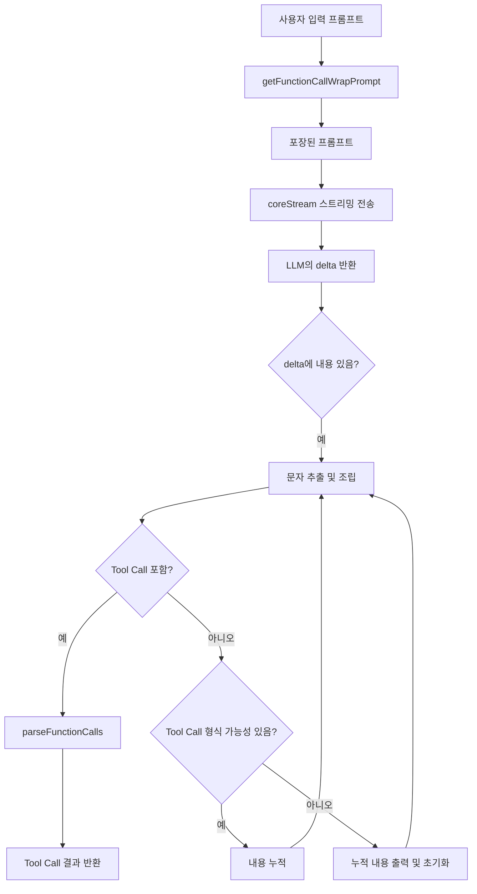
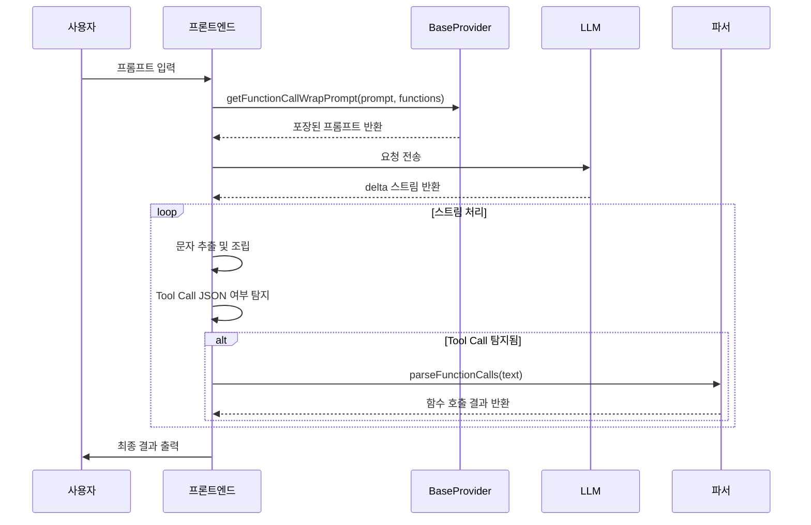

# DeepChat Tool Use 기술 문서

## 배경 및 목표

LLM(대형 언어 모델)의 Function Calling 기능이 강화됨에 따라, DeepChat은 **프롬프트 엔지니어링(prompt engineering)**을 통해 **네이티브 Function Calling 없이도 Tool Use 동작을 시뮬레이션**할 수 있도록 지원합니다.

설계 목표:
- 표준화된 프롬프트 포장을 통해 모델이 도구를 정해진 형식으로 호출하도록 유도
- Function Calling을 지원하지 않는 다양한 LLM 모델과의 호환성 확보
- 다중 Tool 사용 및 복잡한 스케줄링 시나리오 확장 지원

---

## 구조 개요

| 구성 요소                     | 설명                                                             |
| :--------------------------- | :--------------------------------------------------------------- |
| `baseProvider.ts`            | 기본 프롬프트 포장 및 Tool Use 로직 정의                         |
| `openAICompatibleProvider.ts`| OpenAI 등과 호환되는 인터페이스 구현 및 function call 파싱 구현 |
| 핵심 함수                    | `getFunctionCallWrapPrompt`, `coreStream`, `parseFunctionCalls` |

---

## 전체 흐름 개요

1. **프롬프트 포장**: `getFunctionCallWrapPrompt`로 사용자 입력과 Tools를 포장
2. **스트림 처리**: `coreStream`으로 모델의 delta 스트림 수신
3. **함수 호출 파싱**: `parseFunctionCalls`로 자연어에서 Tool Call JSON 추출

---

## 핵심 모듈 상세 설명

### 1. getFunctionCallWrapPrompt(prompt, functions)

**기능**:  
> 사용자 입력 프롬프트와 사용 가능한 도구 목록을 JSON 형식으로 포장하여 LLM이 Tool Call을 정해진 형식으로 응답하도록 유도

**주요 로직**:
- 모든 함수의 이름과 파라미터 포맷 나열
- 예시 포맷 정의:
```json
{ "tool_name": "xxx", "parameters": { "key": "value" } }
```
- 사용자 입력을 자연스럽게 삽입

**핵심 아이디어**:  
Function Calling을 지원하지 않는 모델도 도구 호출이 가능하도록 유도

---

### 2. coreStream(config)

**기능**:  
> LLM에 요청을 스트리밍 방식으로 보내고, 응답 delta를 실시간으로 수신/처리

**처리 세부사항**:
- delta 수신 시 마다:
  - `content` 포함 여부 판단
  - JSON 형식을 유지하도록 문자 단위 조립
  - 새로운 reply 문자열로 포장하여 누락 방지
- 조립 로직:
  - `{ "tool_name"` 등의 특징으로 Tool Call JSON 여부 탐지
  - 조각난 텍스트 병합

- Tool Call JSON이 완성되면 즉시 `parseFunctionCalls` 호출

**상태 머신 흐름**:


---

### 3. parseFunctionCalls(text)

**기능**:  
> 자연어 응답에서 Tool Call JSON을 추출하고 JavaScript 객체로 파싱

**주요 로직**:
- 정규표현식으로 `{...}` JSON 탐지
- 다중 Tool Call 동시 존재 지원
- 비정상 JSON(문자열 누락, 괄호 미닫힘 등)에 대한 오류 보정 지원

---

## 전체 흐름도 (Mermaid)



---

## 시퀀스 다이어그램 (Mermaid)



---

## 설계의 주요 특징

- **프롬프트 포장 지능화**: Function Calling 미지원 모델도 도구 호출 유도 가능
- **정교한 스트리밍 처리**: 문자 단위 조립 및 검사
- **높은 내결함성**: 불완전하거나 중첩된 Tool Use JSON도 유연하게 파싱 가능

---

## 향후 개선 방향

- 모델 특성에 따라 Prompt를 동적으로 최적화하는 기능
- 중첩된 Tool Call 지원 (도구 내부에서 다른 도구 호출)
- 멀티턴 대화에서 Tool Use 상태 상속 및 독립 관리
