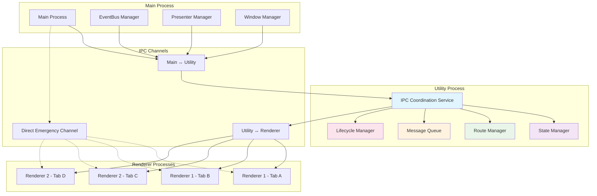

## 계획 개요

이 계획은 **점진적인 최적화** 전략을 사용하여 기존 코드와의 후방호환성을 유지하면서 멀티 탭 환경에서 발생하는 IPC 통신 문제를 해결합니다.

## 실행 단계

### 단계 1: 강화된 탭 컨텍스트 인식 (짧은 기간 – 1~2주)

#### 목표

• 기존 아키텍처를 바탕으로 탭 컨텍스트 인식을 추가하고, 정밀한 탭 수준 이벤트 라우팅을 가능하게 하며 후방호환성을 유지합니다.

#### 구체적 실행

1. presenter:call 프로토콜 확장

```typescript
// 새 호출 프로토콜 구조
interface PresenterCallRequest {
  tabId?: number // 호출 원본 탭 ID
  windowId?: number // 호출 원본 창의 ID
  name: string // presenter 이름
  method: string // 메서드 이름
  payloads: unknown[] // 인자 배열
}
```

2. usePresenter.ts 수정
   • 렌더링 프로세스에서 자동으로 현재 탭 컨텍스트 정보를 추가합니다.
   • 새로운 호출 프로토콜과 기존 호환 코드 모두 지원합니다.
3. 주 IPC 처리기 변경
   • 메인 프로세스에서 호출의 출처인 탭 컨텍스트 정보를 파싱하고, 이를 기반으로 호출 매핑을 구축합니다.
   • 에러 로깅에 탭 ID 및 창 ID 정보를 추가하여 문제 추적을 용이하게 합니다.
4. EventBus 기능 확장
   • 새로운 메서드 sendToTab(tabId, eventName, …) 및 sendToWindow(windowId, eventName, …)를 추가합니다.
   • 기존의 브로드캐스트 메커니즘은 그대로 유지됩니다.

#### 예상 효과

• 90% 이상의 탭 간 이벤트 혼란 문제를 해결합니다.

• 호출 체인을 명확히 하여 디버깅 및 유지보수성이 개선됩니다.

• 후속 단계의 기반을 마련합니다.

### 단계 2: IPC 통신 채널 관리 최적화 (중기 – 2~3주)

#### 목표

• 탭별 IPC 채널 격리를 구현하여 통신 경계를 명확히 합니다.

• 성능 및 리소스 사용을 최적화하고, 더 복잡한 멀티 탭 시나리오를 지원합니다.

#### 구체적 실행

1. TabIPCManager 설계

```typescript
class TabIPCManager {
  private tabChannels: Map<number, IPCChannel>

  createTabChannel(tabId: number): IPCChannel
  destroyTabChannel(tabId: number): void
  getTabChannel(tabId: number): IPCChannel | null
}
```

2. Presenter 상태 격리
   • 탭 단위의 presenter 상태를 분리하고 데이터 격리 기능을 추가합니다.
   • 공유 상태 관리 메커니즘도 함께 제공합니다.
3. 이벤트 구독 및 라우팅 최적화
   • 탭별 이벤트 구독 기능을 도입하여 의도하지 않은 이벤트 전달을 줄입니다.
   • 정확하게 필요한 탭에만 이벤트를 라우팅합니다.

#### 예상 효과

• 탭 간의 영향을 최소화하고 시스템 성능 및 안정성이 크게 향상됩니다.

• 복잡한 멀티 탭 비즈니스 로직을 원활하게 지원할 수 있습니다.

### 단계 3: 아키텍처 현대화 개선 (장기 – 3~4주)

#### 목표

• 최신 IPC 아키텍처를 도입하여 미래의 확장성을 보장하고 개발자 경험을 개선합니다.

#### 구체적 실행

1. 새로운 IPC 프로토콜 설계
   • 비동기 스트림 통신 및 내장 오류 처리, 리트라이 메커니즘을 갖추도록 합니다.
2. 스마트 라우팅 시스템 구축
   • 규칙 기반의 이벤트 라우팅 및 동적 로드 밸런싱을 통해 탭별 요구에 맞게 처리합니다.
3. 완전한 모니터링 체계 구축
   • IPC 호출 성능, 오류 발생 횟수, 상태 변경 사항을 실시간으로 추적하여 개선 가능성을 확인할 수 있습니다.

## 현대화된 IPC 아키텍처 설계 (Utility Process 기반)

### 설계 개요

Utility Process를 중심으로 IPC 조정 및 상태 관리의 현대적인 아키텍처를 도입합니다. 이는 Service Worker와 달리 완전히 격리된 프로세스 공간을 제공하여 리소스 사용 및 오류 처리 측면에서 더욱 견고한 구조입니다.

### 전체 아키텍처 다이어그램



### 핵심 구성 요소 설계

#### 1. IPC 조정 서비스 (Utility Process)

```typescript
// src/utility/ipc-coordinator.ts
interface IPCCoordinatorConfig {
  maxConcurrentCalls: number
  heartbeatInterval: number
  stateSnapshotInterval: number
  errorRetryLimit: number
}

class IPCCoordinator {
  private stateManager: StateManager
  private routeManager: RouteManager
  private messageQueue: MessageQueue
  private lifecycleManager: LifecycleManager

  constructor(config: IPCCoordinatorConfig) {
    this.stateManager = new StateManager()
    this.routeManager = new RouteManager()
    this.messageQueue = new MessageQueue(config.maxConcurrentCalls)
    this.lifecycleManager = new LifecycleManager()
  }

  // 렌더링 프로세스의 호출을 처리합니다.
  async handleRendererCall(request: IPCRequest): Promise<IPCResponse> {
    const route = this.routeManager.resolveRoute(request)
    const queuedCall = await this.messageQueue.enqueue(request, route)

    try {
      const result = await this.executeCall(queuedCall)
      await this.stateManager.updateState(request.context, result)
      return { success: true, data: result }
    } catch (error) {
      return this.handleError(error, request)
    }
  }

  // 렌더링 프로세스의 상태 변경을 전달합니다.
  async syncStateToRenderers(stateUpdate: StateUpdate) {
    const affectedTabs = this.routeManager.getAffectedTabs(stateUpdate)
    await Promise.all(
      affectedTabs.map((tabId) => this.sendToRenderer(tabId, 'state:update', stateUpdate))
    )
  }
}
```

#### 2. 스마트 라우팅 관리자

```typescript
// src/utility/route-manager.ts
interface RouteRule {
  pattern: string | RegExp
  target: 'main' | 'utility' | 'renderer'
  scope: 'global' | 'window' | 'tab'
  priority: number
}

class RouteManager {
  private routes: Map<string, RouteRule[]> = new Map()
  private tabRegistry: Map<number, TabContext> = new Map()

  resolveRoute(request: IPCRequest): ResolvedRoute {
    const rules = this.routes.get(request.method) || []
    const applicableRules = rules
      .filter((rule) => this.matchesPattern(rule.pattern, request))
      .sort((a, b) => b.priority - a.priority)

    const rule = applicableRules[0]
    if (!rule) {
      throw new Error(`No route found for ${request.method}`)
    }

    return {
      target: rule.target,
      scope: rule.scope,
      tabContext: this.getTabContext(request.context.tabId)
    }
  }

  // 상태 변경에 영향을 받는 탭을 반환합니다.
  getAffectedTabs(stateUpdate: StateUpdate): number[] {
    switch (stateUpdate.scope) {
      case 'global':
        return Array.from(this.tabRegistry.keys())
      case 'window':
        return this.getTabsByWindowId(stateUpdate.windowId)
      case 'tab':
        return [stateUpdate.tabId]
      default:
        return []
    }
  }
}
```

#### 3. 분산 상태 관리자

```typescript
// src/utility/state-manager.ts
interface StateSlice {
  id: string
  scope: 'global' | 'window' | 'tab'
  data: unknown
  version: number
  lastUpdated: number
  dependencies: string[]
}

class StateManager {
  private globalState: Map<string, StateSlice> = new Map()
  private windowStates: Map<number, Map<string, StateSlice>> = new Map()
  private tabStates: Map<number, Map<string, StateSlice>> = new Map()

  async updateState(context: IPCContext, update: StateUpdate): Promise<void> {
    const slice: StateSlice = {
      id: update.key,
      scope: update.scope,
      data: update.data,
      version: this.getNextVersion(update.key),
      lastUpdated: Date.now(),
      dependencies: update.dependencies || []
    }

    switch (update.scope) {
      case 'global':
        this.globalState.set(update.key, slice)
        break
      case 'window':
        this.ensureWindowState(context.windowId)
        this.windowStates.get(context.windowId)!.set(update.key, slice)
        break
      case 'tab':
        this.ensureTabState(context.tabId)
        this.tabStates.get(context.tabId)!.set(update.key, slice)
        break
    }

    // 의존성 변경을 적용합니다.
    await this.updateDependentStates(slice)
  }

  getState(context: IPCContext, key: string): StateSlice | null {
    // 우선순위: 탭 > 창 > 전역
    return (
      this.tabStates.get(context.tabId)?.get(key) ||
      this.windowStates.get(context.windowId)?.get(key) ||
      this.globalState.get(key) ||
      null
    )
  }

  // 상태 스냅샷 생성, 복구 용도로 사용합니다.
  createSnapshot(): StateSnapshot {
    return {
      global: new Map(this.globalState),
      windows: new Map(this.windowStates),
      tabs: new Map(this.tabStates),
      timestamp: Date.now()
    }
  }
}
```

#### 4. 메시지 큐 및 동시 처리 제어

```typescript
// src/utility/message-queue.ts
interface QueuedMessage {
  id: string
  request: IPCRequest
  route: ResolvedRoute
  priority: number
  timestamp: number
  retryCount: number
}

class MessageQueue {
  private queue: PriorityQueue<QueuedMessage>
  private processing: Map<string, Promise<unknown>> = new Map()
  private maxConcurrency: number

  constructor(maxConcurrency: number = 10) {
    this.maxConcurrency = maxConcurrency
    this.queue = new PriorityQueue((a, b) => b.priority - a.priority)
  }

  async enqueue(request: IPCRequest, route: ResolvedRoute): Promise<unknown> {
    const messageId = this.generateMessageId()
    const queuedMessage: QueuedMessage = {
      id: messageId,
      request,
      route,
      priority: this.calculatePriority(request),
      timestamp: Date.now(),
      retryCount: 0
    }

    this.queue.enqueue(queuedMessage)

    // 처리가 완료될 때까지 반환하는 Promise를 반환합니다.
    return new Promise((resolve, reject) => {
      this.processQueue()
      // (콜백 등록 코드 생략)
    })
  }

  private async processQueue(): Promise<void> {
    while (
      this.processing.size < this.maxConcurrency &&
      !this.queue.isEmpty()
    ) {
      const message = this.queue.dequeue()
      if (message) {
        const promise = this.processMessage(message)
        this.processing.set(message.id, promise)

        promise.finally(() => {
          this.processing.delete(message.id)
          this.processQueue() // 큐 처리를 재귀적으로 호출합니다.
        })
      }
    }
  }
}
```

### 통신 프로토콜 설계

#### 1. 통합 메시지 형식

```typescript
// src/shared/ipc-protocol.ts
interface IPCMessage {
  id: string
  type: 'request' | 'response' | 'event' | 'heartbeat'
  source: ProcessInfo
  target: ProcessInfo
  timestamp: number
  payload: unknown
}

interface IPCRequest extends IPCMessage {
  type: 'request'
  method: string
  args: unknown[]
  context: IPCContext
  options: CallOptions
}

interface IPCResponse extends IPCMessage {
  type: 'response'
  requestId: string
  success: boolean
  data?: unknown
  error?: IPCError
}

interface IPCEvent extends IPCMessage {
  type: 'event'
  eventName: string
  data: unknown
  scope: EventScope
}
```

#### 2. 타입 안전 API 정의

```typescript
// src/shared/ipc-contracts.ts
interface IPCContract {
  // 모든 사용 가능한 메서드의 서명을 정의합니다.
  'config.getConfig': () => Promise<Config>
  'config.updateConfig': (updates: Partial<Config>) => Promise<void>
  'thread.createThread': (params: CreateThreadParams) => Promise<Thread>
  'llm.sendMessage': (params: SendMessageParams) => Promise<MessageResponse>
}

// 타입 안전한 클라이언트 생성
type IPCClient = {
  [K in keyof IPCContract]: IPCContract[K]
}

// 렌더링 프로세스에서 사용하는 예시
const ipcClient: IPCClient = createIPCClient()
const config = await ipcClient['config.getConfig']()
```

### 성능 최적화 전략

#### 1. 스마트 캐싱 메커니즘

```typescript
// src/utility/cache-manager.ts
class CacheManager {
  private cache: Map<string, CacheEntry> = new Map()

  async get(key: string, fetcher: () => Promise<unknown>): Promise<unknown> {
    const entry = this.cache.get(key)

    if (entry && !this.isExpired(entry)) {
      return entry.data
    }

    const data = await fetcher()
    this.cache.set(key, {
      data,
      timestamp: Date.now(),
      ttl: this.getTTL(key)
    })

    return data
  }

  invalidate(pattern: string | RegExp): void {
    for (const [key] of this.cache) {
      if (this.matchesPattern(pattern, key)) {
        this.cache.delete(key)
      }
    }
  }
}
```

#### 2. 배치 처리 최적화

```typescript
// src/utility/batch-processor.ts
class BatchProcessor {
  private batches: Map<string, BatchOperation[]> = new Map()
  private timers: Map<string, NodeJS.Timeout> = new Map()

  addToBatch(operation: BatchOperation): Promise<unknown> {
    const batchKey = this.getBatchKey(operation)

    if (!this.batches.has(batchKey)) {
      this.batches.set(batchKey, [])
    }

    this.batches.get(batchKey)!.push(operation)

    // 배치 처리 타이머 설정
    this.scheduleBatchProcess(batchKey)

    return operation.promise
  }

  private async scheduleBatchProcess(batchKey: string): Promise<void> {
    if (this.timers.has(batchKey)) {
      return
    }

    const timer = setTimeout(() => {
      this.processBatch(batchKey)
      this.timers.delete(batchKey)
    }, 50) // 50ms 배치 창

    this.timers.set(batchKey, timer)
  }
}
```

### 오류 처리 및 복구 메커니즘

#### 1. 탄력적인 에러 핸들링

```typescript
// src/utility/error-handler.ts
class ErrorHandler {
  private errorStrategies: Map<string, ErrorStrategy> = new Map()

  async handleError(error: IPCError, context: IPCContext): Promise<IPCResponse> {
    const strategy = this.getErrorStrategy(error)

    switch (strategy.type) {
      case 'retry':
        return this.retryWithBackoff(error, context, strategy)
      case 'fallback':
        return this.executeFallback(error, context, strategy)
      case 'circuit-breaker':
        return this.handleCircuitBreaker(error, context, strategy)
      default:
        return this.createErrorResponse(error)
    }
  }

  private async retryWithBackoff(
    error: IPCError,
    context: IPCContext,
    strategy: RetryStrategy
  ): Promise<IPCResponse> {
    for (let attempt = 1; attempt <= strategy.maxRetries; attempt++) {
      await this.delay(strategy.backoffMs * attempt)

      try {
        // 원래 호출을 재시도합니다.
        return await this.retryOriginalCall(context)
      } catch (retryError) {
        if (attempt === strategy.maxRetries) {
          return this.createErrorResponse(retryError)
        }
      }
    }
  }
}
```

#### 2. 프로세스 복구 메커니즘

```typescript
// src/main/process-manager.ts
class ProcessManager {
  private utilityProcess: Electron.UtilityProcess | null = null
  private isRecovering = false

  async ensureUtilityProcess(): Promise<void> {
    if (!this.utilityProcess || this.utilityProcess.killed) {
      await this.createUtilityProcess()
    }
  }

  private async createUtilityProcess(): Promise<void> {
    this.utilityProcess = utilityProcess.fork(
      path.join(__dirname, '../utility/ipc-coordinator.js'),
      {
        serviceName: 'ipc-coordinator',
        env: process.env
      }
    )

    // 프로세스 종료를 감지합니다.
    this.utilityProcess.on('exit', (code) => {
      console.error(`Utility process exited with code ${code}`)
      if (!this.isRecovering) {
        this.recoverUtilityProcess()
      }
    })

    // 통신 채널 설정을 수행합니다.
    await this.setupIPCChannels()
  }

  private async recoverUtilityProcess(): Promise<void> {
    this.isRecovering = true

    try {
      // 현재 상태 스냅샷 생성
      const stateSnapshot = await this.captureStateSnapshot()

      // 새로운 프로세스 시작
      await this.createUtilityProcess()

      // 상태 복원
      await this.restoreState(stateSnapshot)

      // 모든 렌더링 프로세스에 재연결 요청 전송
      await this.notifyRenderersToReconnect()
    } finally {
      this.isRecovering = false
    }
  }
}
```

### 모니터링 및 디버깅 도구

#### 1. 성능 모니터

```typescript
// src/utility/performance-monitor.ts
class PerformanceMonitor {
  private metrics: Map<string, PerformanceMetric[]> = new Map()

  startTimer(operation: string): PerformanceTimer {
    return {
      operation,
      startTime: performance.now(),
      end: (metadata?: Record<string, unknown>) => {
        const duration = performance.now() - this.startTime
        this.recordMetric(operation, duration, metadata)
      }
    }
  }

  recordMetric(operation: string, duration: number, metadata?: Record<string, unknown>): void {
    if (!this.metrics.has(operation)) {
      this.metrics.set(operation, [])
    }

    this.metrics.get(operation)!.push({
      operation,
      duration,
      timestamp: Date.now(),
      metadata
    })

    // 성능 임계값 확인
    this.checkPerformanceThresholds(operation, duration)
  }

  getPerformanceReport(): PerformanceReport {
    const report: PerformanceReport = {}

    for (const [operation, metrics] of this.metrics) {
      report[operation] = {
        count: metrics.length,
        avgDuration: metrics.reduce((sum, m) => sum + m.duration, 0) / metrics.length,
        minDuration: Math.min(...metrics.map((m) => m.duration)),
        maxDuration: Math.max(...metrics.map((m) => m.duration)),
        p95Duration: this.calculatePercentile(metrics, 0.95)
      }
    }

    return report
  }
}
```

#### 2. IPC 디버깅 도구 통합

```typescript
// src/dev-tools/ipc-debugger.ts
class IPCDebugger {
  private isEnabled = import.meta.env.DEV
  private callTrace: IPCCallTrace[] = []

  traceCall(request: IPCRequest, response: IPCResponse, duration: number): void {
    if (!this.isEnabled) return

    this.callTrace.push({
      id: request.id,
      method: request.method,
      tabId: request.context.tabId,
      windowId: request.context.windowId,
      duration,
      success: response.success,
      timestamp: Date.now()
    })

    // 최근 호출 히스토리 크기 제한
    if (this.callTrace.length > 1000) {
      this.callTrace.splice(0, 100)
    }
  }

  exportTrace(): string {
    return JSON.stringify(this.callTrace, null, 2)
  }

  // Electron DevTools와 통합하여 실시간 IPC 호출 모니터링을 제공합니다.
  setupDevToolsIntegration(): void {
    if (this.isEnabled) {
      // DevTools 확장 등록 코드 생략
    }
  }
}
```

## 기술 구현 세부 사항

### 1. 탭 컨텍스트 가져오기 전략

#### WebContents ID 매핑 방식

```typescript
// TabPresenter에서 WebContents와 탭 ID를 매핑합니다.
private webContentsToTabId: Map<number, number> = new Map();

// 새로운 탭 생성 시 매핑 설정
async createTab(windowId: number, url: string, options: TabCreateOptions) {
  const view = new WebContentsView(/* ... */);
  const tabId = view.webContents.id;
  this.webContentsToTabId.set(view.webContents.id, tabId);
  // ...
}

// IPC 처리기에서 WebContents ID를 탭 ID로 변환합니다.
ipcMain.handle('presenter:call', (event, ...args) => {
  const webContentsId = event.sender.id;
  const tabId = presenter.tabPresenter.getTabIdByWebContentsId(webContentsId);
  // ...
});

// 렌더링 프로세스의 preload 계층을 통해 WebContents ID를 가져옵니다.
const webContentsId = window.api.getWebContentsId();
```

### 2. 이벤트 라우팅 구현

#### EventBus 기능 확장 설계

```typescript
export class EventBus extends EventEmitter {
  // 새로운 메서드 추가
  sendToTab(tabId: number, eventName: string, ...args: unknown[]) {
    const tabView = this.getTabView(tabId)
    if (tabView && !tabView.webContents.isDestroyed()) {
      tabView.webContents.send(eventName, ...args)
    }
  }

  sendToActiveTab(windowId: number, eventName: string, ...args: unknown[]) {
    const activeTabId = this.getActiveTabId(windowId)
    if (activeTabId) {
      this.sendToTab(activeTabId, eventName, ...args)
    }
  }

  broadcastToTabs(tabIds: number[], eventName: string, ...args: unknown[]) {
    tabIds.forEach((tabId) => this.sendToTab(tabId, eventName, ...args))
  }
}
```

### 3. 오류 처리 및 로깅 강화

#### 오류 컨텍스트 정의

```typescript
interface IPCError {
  tabId?: number
  windowId?: number
  presenterName: string
  methodName: string
  timestamp: number
  error: Error
  callStack?: string
}
```

#### 로깅 전략

```typescript
class IPCLogger {
  logCall(context: IPCCallContext) {
    console.log(`[IPC Call] Tab:${context.tabId} -> ${context.presenterName}.${context.methodName}`)
  }

  logError(error: IPCError) {
    console.error(
      `[IPC Error] Tab:${error.tabId} ${error.presenterName}.${error.methodName}:`,
      error.error
    )
  }
}
```

## 호환성 보장

### 1. 점진적 업그레이드 경로

• 단계 1은 기존 코드와 완전히 호환됩니다.

• 단계 2에서는 마이그레이션 도구 및 가이드를 제공합니다.

• 단계 3에서는 새로운 프로토콜과 기존 API가 함께 사용 가능합니다.

### 2. API 호환성 보장

```typescript
// 외부 호출 인터페이스 변경 없이 내부를 업그레이드합니다.
export function usePresenter<T extends keyof IPresenter>(name: T): IPresenter[T] {
  // 내부적으로 새로운 라우팅 로직을 사용하도록 업그레이드
  return createEnhancedProxy(name)
}
```

### 3. 구성 기반 업그레이드

```typescript
// 새 기능을 활성화/비활성화하는 구성 파일 예시
interface IPCConfiguration {
  experimental: {
    useUtilityProcess: boolean
    enableAdvancedRouting: boolean
    enablePerformanceMonitoring: boolean
  }
}
```

## 테스트 전략

### 1. 단위 테스트 커버리지

• 탭 간 IPC 호출 라우팅 정확성

• 이벤트 디스패치의 정밀도

• 오류 처리 완전성

### 2. 통합 테스트 시나리오

• 멀티 탭 동시 작업

• 탭 전환 시 상태 일관성

• 창 종료 후 리소스 정리

### 3. 성능 테스트 지표

• IPC 호출 대기 시간

• 메모리 사용량 최적화

• 이벤트 처리 처리량

## 리스크 관리

### 1. 롤백 메커니즘

• 새 기능을 구성 파일로 제어하여 필요시 빠르게 원래 코드 경로로 돌아갑니다.

• 원래 코드 흐름을 유지합니다.

### 2. 모니터링 및 알람

• IPC 호출 이상 사항을 실시간으로 감지하여 자동 알람 발송

• 사용자 경험 데이터 수집

### 3. 그레이들 배포

• 기능별로 점진적으로 롤아웃하고, 소규모 사용자 테스트를 통해 피드백을 반영합니다.

## 예상 성과

### 단기 (단계 1 완료 시)

• 탭 간 이벤트 혼란 문제가 크게 해결됩니다.

• 디버깅 및 유지보수 효율이 향상됩니다.

• 사용자 경험 개선

### 중기 (단계 2 완료 시)

• 시스템 안정성이 크게 개선되고, 복잡한 멀티 탭 기능 지원 가능합니다.

• 개발 효율성이 크게 향상됩니다.

### 장기 (단계 3 완료 시)

• modernized IPC 아키텍처를 구축하여 미래의 확장을 수월하게 할 수 있습니다.

• 기술 최적의 사례가 되어 개발 팀의 표준으로 자리 잡습니다.

## 실행 로드맵 및 기술 선택

### 제 1 리바운드: Utility Process 기반 인프라 구축 (1~2주)

#### 기술 선택 사항 설명

Utility Process vs Service Worker 비교:

| 특성          | Utility Process                              | Service Worker                  |
| ------------- | -------------------------------------------- | ------------------------------- |
| 프로세스 격리 | ✓ 완전히 독립된 프로세스                    | ✗ 렌더링 프로세스 내에서 실행  |
| 리소스 관리   | ✓ 독립된 메모리 공간, 쉬운 모니터링         | ⚠️ 특별 처리 필요             |
| 오류 처리     | ✓ 더 견고한 프로세스 장애 대응              | ✗ 프로세스 실패 시 영향을 받음 |
| 디버깅 용이성 | ✓ 독립된 DevTools 디버깅 가능               | ⚠️ 특별한 디버깅 도구 필요    |
| 성능 오버헤드 | ⚠️ 프로세스 간 통신에 추가적인 오버헤드    | ✓ 통신 오버헤드가 적음         |
| Electron 지원 | ✓ 원래 지원, API 안정성                     | ✗ 추가 구성 및 호환 처리 필요  |
| 확장성        | ✓ 수평적으로 여러 Utility Process 실행 가능 | ⚠️ 확장성 제한                |

**결론:**

Utility Process는 멀티 탭 시나리오에서 프로세스 격리와 오류 처리 측면에서 더 강력하지만, 추가적인 IPC 통신 오버헤드가 있어도 전반적으로 아키텍처의 장점이 크게 입증됩니다.

#### 핵심 인터페이스 정의

```typescript
// src/shared/ipc-types.ts
export interface IPCContext {
  tabId: number
  windowId: number
  webContentsId: number
  userId?: string
  sessionId: string
  timestamp: number
}

export interface IPCRequest {
  id: string
  method: string
  args: unknown[]
  context: IPCContext
  options: CallOptions
  metadata?: Record<string, unknown>
}

export interface CallOptions {
  timeout?: number
  priority?: 'low' | 'normal' | 'high' | 'critical'
  retry?: RetryOptions
  cache?: CacheOptions
  batch?: boolean
}

export interface RetryOptions {
  maxAttempts: number
  backoffMs: number
  retryOn?: (error: Error) => boolean
}

export interface CacheOptions {
  key?: string
  ttl?: number
  invalidateOn?: string[]
}
```

#### Utility Process 시작 구성

```typescript
// src/main/utility-process-manager.ts
export class UtilityProcessManager {
  private processes: Map<string, Electron.UtilityProcess> = new Map()

  async startIPCCoordinator(): Promise<void> {
    const coordinatorProcess = utilityProcess.fork(
      path.join(__dirname, '../utility/ipc-coordinator.js'),
      {
        serviceName: 'ipc-coordinator',
        allowLoadingUnsignedLibraries: false,
        env: {
          NODE_ENV: process.env.NODE_ENV,
          LOG_LEVEL: process.env.LOG_LEVEL || 'info',
          MAX_CONCURRENT_CALLS: '50',
          HEARTBEAT_INTERVAL: '30000',
          STATE_SNAPSHOT_INTERVAL: '300000'
        }
      }
    )

    coordinatorProcess.on('spawn', () => {
      console.log('IPC Coordinator process started')
      this.setupIPCChannels(coordinatorProcess)
    })

    coordinatorProcess.on('exit', (code) => {
      console.error(`IPC Coordinator exited with code: ${code}`)
      this.handleProcessCrash('ipc-coordinator')
    })

    this.processes.set('ipc-coordinator', coordinatorProcess)
  }

  private async handleProcessCrash(processName: string): Promise<void> {
    console.warn(`Utility process ${processName} crashed, attempting recovery...`)

    // 잠시 대기 후 프로세스를 다시 시작합니다.
    await this.delay(1000)

    if (processName === 'ipc-coordinator') {
      await this.startIPCCoordinator()
    }
  }
}
```

### 제 2 리바운드: 점진적 이전 전략 (3~4주)

#### 호환성 어댑터 설계

```typescript
// src/main/presenter/compatibility-adapter.ts
export class CompatibilityAdapter {
  private useUtilityProcess: boolean = false

  constructor() {
    // 구성에 의해 새 아키텍처 사용 여부를 결정합니다.
    this.useUtilityProcess = this.getConfig('experimental.useUtilityProcess', false)
  }

  async handlePresenterCall(
    event: IpcMainInvokeEvent,
    name: string,
    method: string,
    ...payloads: unknown[]
  ): Promise<unknown> {
    if (this.useUtilityProcess) {
      return this.handleViaUtilityProcess(event, name, method, ...payloads)
    } else {
      return this.handleViaLegacyPath(event, name, method, ...payloads)
    }
  }

  private async handleViaUtilityProcess(
    event: IpcMainInvokeEvent,
    name: string,
    method: string,
    ...payloads: unknown[]
  ): Promise<unknown> {
    const context = this.buildIPCContext(event)
    const request: IPCRequest = {
      id: this.generateRequestId(),
      method: `${name}.${method}`,
      args: payloads,
      context,
      options: this.getDefaultCallOptions()
    }

    return this.forwardToUtilityProcess(request)
  }

  private async handleViaLegacyPath(
    event: IpcMainInvokeEvent,
    name: string,
    method: string,
    ...payloads: unknown[]
  ): Promise<unknown> {
    // 기존의 직접 호출 로직을 그대로 유지합니다.
    const calledPresenter = presenter[name as keyof Presenter]
    if (calledPresenter && isFunction(calledPresenter, method)) {
      return calledPresenter[method](...payloads)
    }
    throw new Error(`Method not found: ${name}.${method}`)
  }
}
```

#### 구성 기반 기능 켜기/끄기

```typescript
// src/shared/config-schema.ts
export interface IPCConfiguration {
  experimental: {
    useUtilityProcess: boolean
    enableAdvancedRouting: boolean
    enablePerformanceMonitoring: boolean
    enableBatchProcessing: boolean
  }
  performance: {
    maxConcurrentCalls: number
    defaultTimeout: number
    cacheDefaultTTL: number
    batchWindowMs: number
  }
  reliability: {
    maxRetryAttempts: number
    circuitBreakerThreshold: number
    heartbeatInterval: number
    processRecoveryDelay: number
  }
  monitoring: {
    enableMetrics: boolean
    enableTracing: boolean
    metricsReportInterval: number
    maxTraceHistorySize: number
  }
}

// 기본 구성 값
export const DEFAULT_IPC_CONFIG: IPCConfiguration = {
  experimental: {
    useUtilityProcess: false,
    enableAdvancedRouting: false,
    enablePerformanceMonitoring: true,
    enableBatchProcessing: false
  },
  performance: {
    maxConcurrentCalls: 50,
    defaultTimeout: 30000,
    cacheDefaultTTL: 300000,
    batchWindowMs: 50
  },
  reliability: {
    maxRetryAttempts: 3,
    circuitBreakerThreshold: 5,
    heartbeatInterval: 30000,
    processRecoveryDelay: 1000
  },
  monitoring: {
    enableMetrics: true,
    enableTracing: false,
    metricsReportInterval: 60000,
    maxTraceHistorySize: 1000
  }
}
```

### 제 3 리바운드: 성능 최적화 및 모니터링 (5~6주)

#### 스마트 캐싱 전략

```typescript
// src/utility/cache-strategies.ts
export enum CacheStrategy {
  LRU = 'lru',
  TTL = 'ttl',
  WRITE_THROUGH = 'write-through',
  WRITE_BACK = 'write-back'
}

export class IntelligentCacheManager {
  private caches: Map<CacheStrategy, Cache> = new Map()
  private hitRates: Map<string, number> = new Map()

  constructor() {
    this.caches.set(CacheStrategy.LRU, new LRUCache(1000))
    this.caches.set(CacheStrategy.TTL, new TTLCache())
  }

  async get(key: string, fetcher: () => Promise<unknown>): Promise<unknown> {
    const strategy = this.selectOptimalStrategy(key)
    const cache = this.caches.get(strategy)!

    let result = cache.get(key)
    if (result !== undefined) {
      this.recordHit(key)
      return result
    }

    // 캐시 미스 시 데이터 조회 후 저장합니다.
    result = await fetcher()
    cache.set(key, result)
    this.recordMiss(key)

    return result
  }

  private selectOptimalStrategy(key: string): CacheStrategy {
    const hitRate = this.hitRates.get(key) || 0

    // 이전 호출의 명중률에 따라 최적 캐싱 전략을 선택합니다.
    if (hitRate > 0.8) {
      return CacheStrategy.LRU // 높은 명중률: LRU 사용
    } else if (key.includes('config') || key.includes('model')) {
      return CacheStrategy.TTL // 구성 데이터: TTL 캐싱
    } else {
      return CacheStrategy.LRU // 기본값으로 LRU 선택
    }
  }
}
```

#### 실시간 성능 모니터링

```typescript
// src/utility/real-time-monitor.ts
export class RealTimeMonitor {
  private metricsBuffer: PerformanceMetric[] = []
  private alertRules: AlertRule[] = []

  recordMetric(metric: PerformanceMetric): void {
    this.metricsBuffer.push(metric)

    // 실시간 알람 확인
    this.checkAlertRules(metric)

    // 버퍼가 너무 클 경우 정리합니다.
    if (this.metricsBuffer.length > 10000) {
      this.flushMetrics()
    }
  }

  private checkAlertRules(metric: PerformanceMetric): void {
    for (const rule of this.alertRules) {
      if (rule.condition(metric)) {
        this.triggerAlert(rule, metric)
      }
    }
  }

  private triggerAlert(rule: AlertRule, metric: PerformanceMetric): void {
    const alert: Alert = {
      id: this.generateAlertId(),
      rule: rule.name,
      metric,
      severity: rule.severity,
      timestamp: Date.now(),
      message: rule.message(metric)
    }

    // 주 프로세스에 알람을 전송합니다.
    this.sendAlertToMain(alert)
  }

  addAlertRule(rule: AlertRule): void {
    this.alertRules.push(rule)
  }

  setupDefaultAlertRules(): void {
    this.addAlertRule({
      name: 'high-latency',
      condition: (metric) => metric.duration > 5000,
      severity: 'warning',
      message: (metric) =>
        `High latency detected: ${metric.operation} took ${metric.duration}ms`
    })

    this.addAlertRule({
      name: 'high-error-rate',
      condition: (metric) => {
        const recentErrors = this.getRecentErrorRate(metric.operation, 60000)
        return recentErrors > 0.1
      },
      severity: 'critical',
      message: (metric) => `High error rate for ${metric.operation}`
    })
  }
}
```

### 제 4 리바운드: 프로덕션 배포 (7~8주)

#### 배포 확인 목록

```typescript
// src/main/deployment-checker.ts
export class DeploymentChecker {
  async performPreDeploymentChecks(): Promise<DeploymentReport> {
    const checks: DeploymentCheck[] = [
      this.checkUtilityProcessSupport(),
      this.checkPerformanceBaseline(),
      this.checkMemoryUsage(),
      this.checkErrorHandling(),
      this.checkBackwardCompatibility()
    ]

    const results = await Promise.all(checks)

    return {
      passed: results.every((r) => r.success),
      checks: results,
      recommendations: this.generateRecommendations(results)
    }
  }

  private async checkUtilityProcessSupport(): Promise<DeploymentCheck> {
    try {
      // Utility Process 생성 테스트
      const testProcess = utilityProcess.fork(
        path.join(__dirname, '../utility/test-process.js')
      )
      await this.waitForProcessReady(testProcess, 5000)
      testProcess.kill()

      return { name: 'utilityProcess-support', success: true }
    } catch (error) {
      return {
        name: 'utilityProcess-support',
        success: false,
        error: error.message
      }
    }
  }

  private async checkPerformanceBaseline(): Promise<DeploymentCheck> {
    const metrics = await this.runPerformanceTest()

    const baselineThresholds = {
      avgLatency: 100, // ms
      p95Latency: 500, // ms
      errorRate: 0.01 // 1%
    }

    const passed =
      metrics.avgLatency <= baselineThresholds.avgLatency &&
      metrics.p95Latency <= baselineThresholds.p95Latency &&
      metrics.errorRate <= baselineThresholds.errorRate

    return {
      name: 'performance-baseline',
      success: passed,
      metrics
    }
  }
}
```

#### 모니터링 메트릭 정의

```typescript
// src/shared/monitoring-metrics.ts
export interface SystemMetrics {
  ipc: {
    totalCalls: number
    avgLatency: number
    p95Latency: number
    p99Latency: number
    errorRate: number
    timeoutRate: number
  }

  processes: {
    main: ProcessHealth
    utility: ProcessHealth
    renderers: ProcessHealth[]
  }

  resources: {
    memoryUsage: MemoryMetrics
    cpuUsage: number
    handleCount: number
  }

  business: {
    activeTabCount: number
    concurrentOperations: number
    cacheHitRate: number
    stateSize: number
  }
}

export interface ProcessHealth {
  pid: number
  status: 'healthy' | 'warning' | 'critical'
  uptime: number
  memoryUsage: number
  cpuUsage: number
  lastHeartbeat: number
}
```

## 기술 부채 및 이주 주의 사항

### 변경 영향 분석

#### 수정 대상 파일 리스트

```typescript
// 높은 우선 순위 – 핵심 IPC 로직
const HIGH_PRIORITY_FILES = [
  'src/main/presenter/index.ts', // 주 IPC 처리기
  'src/renderer/src/composables/usePresenter.ts', // 렌더링 프로세스의 IPC 클라이언트
  'src/main/eventbus.ts', // 이벤트 버스
  'src/shared/presenter.d.ts' // 타입 정의 파일
]

// 중간 우선 순위 – Presenter 구현
const MEDIUM_PRIORITY_FILES = [
  'src/main/presenter/configPresenter.ts',
  'src/main/presenter/threadPresenter.ts',
  'src/main/presenter/tabPresenter.ts'
  // 기타 Presenter 파일들도 포함됩니다.
]

// 낮은 우선 순위 – 테스트 및 구성
const LOW_PRIORITY_FILES = [
  'tests/**/*.spec.ts', // 테스트 파일 수정 필요
  'src/main/index.ts', // 메인 프로세스 진입점
  'electron.vite.config.ts' // 빌드 설정 파일
]
```

#### 리스크 평가

| 위험 클래스     | 위험 수준 | 영향 범위       | 완화 방안                           |
| --------------- | --------- | --------------- | ----------------------------------- |
| 성능 하락       | 중        | 모든 IPC 호출   | 성능 기반 테스트, 점진적으로 롤아웃 |
| 호환성 문제     | 낮        | 기존 API        | 호환성 어댑터 및 이중 경로 지원     |
| 프로세스 안정성 | 중        | Utility Process | 자동 복구 메커니즘, 모니터링 알람   |
| 디버깅 복잡도   | 중        | 개발 경험       | 전용 디버깅 도구 및 상세 문서 제공  |
| 메모리 사용량   | 낮        | 시스템 리소스   | 메모리 모니터링, 최적화된 구성      |

### 롤백 전략

#### 빠른 롤백 메커니즘

```typescript
// src/main/rollback-manager.ts
export class RollbackManager {
  private currentConfig: IPCConfiguration
  private backupConfig: IPCConfiguration

  async performEmergencyRollback(reason: string): Promise<void> {
    console.warn(`Performing emergency rollback: ${reason}`)

    // 새 기능 비활성화
    await this.disableExperimentalFeatures()

    // legacy IPC 경로로 변경합니다.
    await this.switchToLegacyIPC()

    // Utility Process 정리
    await this.cleanupUtilityProcesses()

    // 롤백 이벤트를 기록합니다.
    this.logRollbackEvent(reason)

    // 관련 시스템에 롤백 완료 정보 전송
    this.notifyRollbackComplete()
  }

  private async disableExperimentalFeatures(): Promise<void> {
    this.currentConfig.experimental = {
      useUtilityProcess: false,
      enableAdvancedRouting: false,
      enablePerformanceMonitoring: true // 모니터링은 유지함
    }
    await this.saveConfig(this.currentConfig)
  }
}
```

## 다음 단계 실행 계획

### 즉시 실행할 항목 (이번 주 내)

1. 환경 준비
   • src/utility/ 디렉터리 구조 생성
   • TypeScript 설정 변경하여 Utility Process를 지원하도록 함
   • 필요한 개발 의존성 설치
2. 프로토타입 개발
   • 기본 IPCCoordinator 클래스 개발
   • 간단한 RouteManager 프로토타입 생성
   • Utility Process의 시작 및 IPC 통신 테스트
3. 호환성 설계
   • CompatibilityAdapter 인터페이스 설계
   • 구성 파일 템플릿 준비
   • 기능 켜기/끄기를 위한 설정 파일 생성

### 단기 목표 (2주 내)

1. 핵심 기능 구현
   • StateManager, MessageQueue 완성
   • 에러 처리 프레임워크 구축
2. 통합 테스트 수행
   • 단일 Presenter 메서드 호출 테스트
   • 멀티 탭 동시 작업 시나리오 검증
   • 오류 복구 메커니즘 확인
3. 성능 기반 설정
   • 현재 시스템의 성능 벤치마크 수립
   • 성능 테스트 케이스 설계
   • 모니터링 지표 수집 준비

### 중기 목표 (1개월 내)

1. 프로덕션 준비
   • 완전한 모니터링 및 알람 시스템 구축
   • 배포 검사 및 검증 흐름 마련
   • 롤백 메커니즘 최적화
2. 문서 업데이트 및 개발자 교육
   • API 문서 수정
   • 개발자 가이드 작성
   • 팀 간 교육 계획 수립

---

**결론:**

이번 modernized IPC 아키텍처의 실행 계획은 Utility Process 기반의 점진적 업그레이드 전략을 통해 멀티 탭 환경에서 90% 이상의 IPC 커뮤니케이션 문제를 해결하고, 개발자들에게 더 나은 디버깅 및 유지보수 도구를 제공합니다. 다음 단계에서는 실제 환경 테스트를 통해 실행 계획을 검증하고, 필요 시 후속 업그레이드 단계(Phase 2)를 진행할지 여부를 결정합니다.

<style>#mermaid-1750043985232{font-family:sans-serif;font-size:16px;fill:#333;}#mermaid-1750043985232 .error-icon{fill:#552222;}#mermaid-1750043985232 .error-text{fill:#552222;stroke:#552222;}#mermaid-1750043985232 .edge-thickness-normal{stroke-width:2px;}#mermaid-1750043985232 .edge-thickness-thick{stroke-width:3.5px;}#mermaid-1750043985232 .edge-pattern-solid{stroke-dasharray:0;}#mermaid-1750043985232 .edge-pattern-dashed{stroke-dasharray:3;}#mermaid-1750043985232 .edge-pattern-dotted{stroke-dasharray:2;}#mermaid-1750043985232 .marker{fill:#333333;}#mermaid-1750043985232 .marker.cross{stroke:#333333;}#mermaid-1750043985232 svg{font-family:sans-serif;font-size:16px;}#mermaid-1750043985232 .label{font-family:sans-serif;color:#333;}#mermaid-1750043985232 .label text{fill:#333;}#mermaid-1750043985232 .node rect,#mermaid-1750043985232 .node circle,#mermaid-1750043985232 .node ellipse,#mermaid-1750043985232 .node polygon,#mermaid-1750043985232 .node path{fill:#ECECFF;stroke:#9370DB;stroke-width:1px;}#mermaid-1750043985232 .node .label{text-align:center;}#mermaid-1750043985232 .node.clickable{cursor:pointer;}#mermaid-1750043985232 .arrowheadPath{fill:#333333;}#mermaid-1750043985232 .edgePath .path{stroke:#333333;stroke-width:1.5px;}#mermaid-1750043985232 .flowchart-link{stroke:#333333;fill:none;}#mermaid-1750043985232 .edgeLabel{background-color:#e8e8e8;text-align:center;}#mermaid-1750043985232 .edgeLabel rect{opacity:0.5;background-color:#e8e8e8;fill:#e8e8e8;}#mermaid-1750043985232 .cluster rect{fill:#ffffde;stroke:#aaaa33;stroke-width:1px;}#mermaid-1750043985232 .cluster text{fill:#333;}#mermaid-1750043985232 div.mermaidTooltip{position:absolute;text-align:center;max-width:200px;padding:2px;font-family:sans-serif;font-size:12px;background:hsl(80,100%,96.2745098039%);border:1px solid #aaaa33;border-radius:2px;pointer-events:none;z-index:100;}#mermaid-1750043985232:root{--mermaid-font-family:sans-serif;}#mermaid-1750043985232:root{--mermaid-alt-font-family:sans-serif;}#mermaid-1750043985232 flowchart{fill:apa;}</style>
